# OmniCart 360: Cloud-Native Enterprise Commerce & Fulfillment Platform
## Production-Grade Cloud Architecture Specification on Amazon Web Services (AWS)

---

### Table of Contents
1. [Title](#1-title)
2. [Abstract](#2-abstract)
3. [Introduction](#3-introduction)
4. [Problem Statement](#4-problem-statement)
5. [Proposed Cloud-Native Platform](#5-proposed-cloud-native-platform)
6. [Functional Modules](#6-functional-modules)
7. [Cloud-Native Architecture](#7-cloud-native-architecture)
8. [AWS Deployment Model](#8-aws-deployment-model)
9. [Compute Architecture](#9-compute-architecture)
10. [Database Architecture](#10-database-architecture)
11. [Storage Architecture](#11-storage-architecture)
12. [Network Architecture](#12-network-architecture)
13. [Security Architecture](#13-security-architecture)
14. [Scalability and High Availability](#14-scalability-and-high-availability)
15. [Monitoring and Logging](#15-monitoring-and-logging)
16. [Backup and Disaster Recovery](#16-backup-and-disaster-recovery)
17. [End-to-End Data Flow](#17-end-to-end-data-flow)
18. [AWS Service Selection Table](#18-aws-service-selection-table)
19. [Architecture Diagram](#19-architecture-diagram)
20. [Cost Optimization](#20-cost-optimization)
21. [Advantages](#21-advantages)
22. [Limitations](#22-limitations)
23. [Conclusion](#23-conclusion)

---

## 1. Title
**OmniCart 360: An Elastic, Multi-Tenant, Cloud-Native Omnichannel Retail and Order Fulfillment Platform Built on Amazon Web Services**

---

## 2. Abstract
Modern digital commerce platforms demand elastic scalability, zero single-points-of-failure (SPOF), sub-second global latency, and strict transactional data integrity during peak demand surges such as flash sales. Traditional monolithic web architectures suffer from tightly coupled dependencies, resource contention, maintenance bottlenecks, and single-datacenter vulnerabilities. 

This paper presents the end-to-end architectural specification for **OmniCart 360**, a modern, production-grade cloud-native platform deployed on Amazon Web Services (AWS). OmniCart 360 leverages a polyglot microservices paradigm orchestrated across containerized workloads (Amazon Elastic Container Service with AWS Fargate) and serverless event-driven functions (AWS Lambda). The platform integrates a multi-tier polyglot persistence strategy consisting of Amazon Aurora PostgreSQL for ACID-compliant transactional order workflows, Amazon DynamoDB for ultra-low latency product catalog and cart session management, and Amazon ElastiCache for Redis for high-throughput distributed caching. 

Security is implemented natively using defense-in-depth principles: zero-trust perimeter enforcement via AWS WAF and Amazon CloudFront, network segmentation across multi-Availability Zone (Multi-AZ) Virtual Private Clouds (VPC), cryptographic isolation with AWS Key Management Service (KMS), and centralized OAuth 2.0 / OpenID Connect (OIDC) identity brokering via Amazon Cognito. Resilience and business continuity are guaranteed through an asynchronous message-driven backbone (Amazon SQS, SNS, and EventBridge) and a multi-region Warm Standby disaster recovery model delivering a Recovery Point Objective (RPO) $\le 5$ minutes and a Recovery Time Objective (RTO) $\le 15$ minutes. The resulting architecture balances operational excellence, cost optimization, and resilience under volatile enterprise workloads.

---

## 3. Introduction
Cloud-native computing represents an architectural philosophy optimized for the dynamic, distributed nature of modern public clouds. Defined by the Cloud Native Computing Foundation (CNCF), cloud-native platforms leverage containerization, declarative infrastructure, service meshes, microservices, and managed serverless backends to build loosely coupled systems that are resilient, manageable, observable, and dynamically scalable.

Enterprises shifting from traditional on-premises or virtualized monolithic applications face escalating challenges:
- **Scalability Mismatch:** Monoliths must scale the entire application stack even if only a single module (e.g., checkout or search) experiences peak traffic.
- **Blast Radius Propagation:** A memory leak or runtime exception in one feature can bring down the entire application runtime.
- **Slow Deployment Cycles:** Monolithic codebases require protracted regression testing and risky, coordinated release windows.
- **Data Model Rigidity:** Single relational databases are forced to handle conflicting access patterns—both high-throughput key-value lookups and complex transactional relational joins.

By refactoring retail commerce and logistics workflows into isolated microservices hosted on AWS, organizations gain operational agility. AWS provides managed infrastructure primitives that eliminate operational toil (undifferentiated heavy lifting), enabling engineering teams to focus strictly on domain logic, customer experience, and system reliability.

---

## 4. Problem Statement
Enterprise retail operations struggle with disparate, legacy software stacks that separate web storefronts, brick-and-mortar point-of-sale (POS) systems, warehouse inventory databases, and third-party logistics (3PL) carriers. This fragmentation results in:
1. **Inventory Discrepancies and Overselling:** Distributed sales channels read stale inventory data, leading to stockouts, cancelled orders, and lost revenue.
2. **Flash Sale Infrastructure Degradation:** Synchronous traffic spikes overwhelm relational databases and web servers, causing cascading HTTP 504 gateway timeouts.
3. **Security and Compliance Exposure:** Inadequate network segmentation, hardcoded API credentials, and lack of end-to-end encryption jeopardize compliance with PCI-DSS (Payment Card Industry Data Security Standard) and GDPR.
4. **Disaster Vulnerability and Data Loss:** Inadequate automated backup and cross-region disaster recovery mechanisms leave businesses vulnerable to regional datacenter outages, hardware corruption, and operational errors.

**OmniCart 360** directly solves these issues by establishing a centralized, event-driven, horizontally scalable cloud-native backbone that unifies catalog browsing, cart persistence, transactional order execution, secure tokenized payments, warehouse dispatch, and real-time customer notifications.

---

## 5. Proposed Cloud-Native Platform

### 5.1 Platform Purpose
**OmniCart 360** is a highly available, multi-tenant digital commerce and order orchestration engine designed to support global retail traffic. It provides uniform RESTful and GraphQL APIs for mobile applications, desktop storefronts, external marketplace syndicators (e.g., Amazon, eBay), and physical retail terminals.

### 5.2 Target Audience and Users
- **End Consumers (Shoppers):** Require responsive browsing, instant full-text product search, persistent shopping carts across devices, and instant order tracking.
- **Store Managers & Merchandisers:** Require real-time inventory management, catalog updates, price tiering, and promotional rule definitions.
- **Warehouse & Fulfillment Personnel:** Require automated order picking lists, packing status updates, and courier dispatch tracking.
- **System Administrators & DevOps Engineers:** Require real-time observability, automated blue/green deployment pipelines, declarative security posture compliance, and automated failure self-healing.

### 5.3 System Interaction Flow Summary
OmniCart 360 decouples synchronous customer interactions (browsing, cart management, checkout initiation) from asynchronous backend processing (fraud analysis, payment settlement, inventory reservation, warehouse picking, notification dispatch). Synchronous requests flow through low-latency edge caches and containerized services, while asynchronous tasks flow through reliable message queues and event buses, guaranteeing zero message loss and eventual consistency across subsystems.

---

## 6. Functional Modules

OmniCart 360 is decomposed into seven decoupled microservices and operational modules:

```
+-----------------------------------------------------------------------------------+
|                                  OmniCart 360                                     |
+-----------------------------------------------------------------------------------+
|  1. Identity & Access Module        |  2. Product Catalog & Search Module         |
|  3. Cart & Session Module           |  4. Order Orchestration Module (Saga)       |
|  5. Payment Processing Module       |  6. Inventory & Warehouse Module            |
|  7. Notification & Dispatch Module  |  8. Analytics & Ingestion Data Pipeline     |
+-----------------------------------------------------------------------------------+
```

### Module Breakdown and Specifications

#### 1. Identity & Access Management Module
- **Purpose:** Manages customer registration, federated social authentication, multi-factor authentication (MFA), role-based access control (RBAC) for staff, and token generation/refresh.
- **AWS Services:** Amazon Cognito User Pools, Amazon Cognito Identity Pools, AWS Secrets Manager, AWS KMS.
- **Inputs/Outputs:** 
  - *Input:* User login credentials, OAuth code grants, MFA one-time passwords (OTP).
  - *Output:* Signed JSON Web Tokens (OIDC Identity Token, Access Token, Refresh Token) containing claims and RBAC scopes.
- **Database/Storage:** Amazon Cognito Managed Directory backed by internal encrypted user directory; cached session invalidation lists in Amazon ElastiCache.
- **Security:** Brute-force protection, adaptive authentication with risk scoring, password hashing via salted SRP (Secure Remote Password) protocol.
- **Scalability:** Serverless scale managed transparently by AWS Cognito supporting thousands of authentications per second.
- **Inter-Module Communication:** Validates user identity via JWT verification at the Application Load Balancer and downstream microservices.

#### 2. Product Catalog & Search Module
- **Purpose:** Provides high-throughput, low-latency querying of product hierarchies, specifications, variants, pricing, and dynamic full-text search.
- **AWS Services:** Amazon ECS (Fargate), Amazon DynamoDB, Amazon OpenSearch Service, Amazon ElastiCache for Redis, Amazon S3.
- **Inputs/Outputs:**
  - *Input:* Filter criteria (category, price range, attributes), search queries, catalog management mutations.
  - *Output:* Paginated JSON product listings, faceted search results, high-resolution image asset URLs.
- **Database/Storage:** 
  - Amazon DynamoDB: Master key-value document store for product metadata.
  - Amazon OpenSearch Service: Inverted indices for fuzzy search, typo tolerance, and faceted filtering.
  - Amazon ElastiCache for Redis: In-memory cache for top 20% most viewed products (Zipfian distribution).
  - Amazon S3: Primary store for raw and optimized product media assets.
- **Security:** Read-only public access via CloudFront CDN; catalog write operations restricted to internal merchandising roles via RBAC.
- **Scalability:** ECS Auto Scaling based on target tracking metrics; DynamoDB on-demand capacity mode; Redis cluster read replicas.
- **Inter-Module Communication:** Listens to inventory adjustment events via Amazon EventBridge to toggle "In-Stock" / "Out-of-Stock" flags dynamically.

#### 3. Cart & Session Management Module
- **Purpose:** Maintains shopping cart items, temporary promotional reservations, and cross-device cart persistence.
- **AWS Services:** Amazon ECS (Fargate), Amazon DynamoDB (with Time-To-Live [TTL]), Amazon ElastiCache for Redis.
- **Inputs/Outputs:**
  - *Input:* Add/update/delete item mutations, apply coupon code, session tokens.
  - *Output:* Aggregated cart object with subtotal, tax estimates, and reservation timestamps.
- **Database/Storage:** DynamoDB table partitioned by `CustomerID` or `SessionID` with automatic item expiration via TTL (e.g., 14 days for guest carts). Active carts cached in ElastiCache Redis.
- **Security:** Strict authorization validation ensuring users can only read or mutate their own cart entity.
- **Scalability:** Sub-10ms single-digit millisecond read/write latency at any scale via DynamoDB single-table design.
- **Inter-Module Communication:** Emits `CartAbandoned` events to the Notification Module via EventBridge; passes cart snapshot to Order Orchestration Module upon checkout.

#### 4. Order Orchestration Module (Distributed Saga Coordinator)
- **Purpose:** Coordinates the multi-step distributed transaction required to execute an order without distributed database locking. Implements the Saga Pattern (Compensating Transactions) across inventory, payment, and shipping.
- **AWS Services:** Amazon ECS (Fargate), AWS Step Functions, Amazon SQS, Amazon Aurora PostgreSQL.
- **Inputs/Outputs:**
  - *Input:* Checkout execution payload (Cart ID, Shipping Address, Payment Token).
  - *Output:* Order confirmation object, current state machine execution ARN, invoice reference.
- **Database/Storage:** Amazon Aurora PostgreSQL (Multi-AZ) storing normalized relational order headers, line items, customer audit trails, and financial ledger records.
- **Security:** Dedicated VPC private database subnet; encrypted using AWS KMS Customer Managed Keys (CMK).
- **Scalability:** Aurora Auto Scaling read replicas; Step Functions handles concurrent state machine executions without server management.
- **Inter-Module Communication:** Orchestrates calls to Payment, Inventory, and Notification modules via synchronous HTTP or asynchronous SQS queues; handles compensating rollbacks if any step fails.

#### 5. Payment Processing Module
- **Purpose:** Ingests payment requests, interfaces with external PCI-compliant payment gateways (Stripe, Adyen, Apple Pay), processes refunds, and maintains an immutable audit log.
- **AWS Services:** AWS Lambda, Amazon API Gateway, AWS Secrets Manager, AWS KMS, Amazon SQS Dead Letter Queues (DLQ).
- **Inputs/Outputs:**
  - *Input:* Idempotency key, Order ID, billing details, payment method token.
  - *Output:* Authorization code, transaction status, captured funds receipt.
- **Database/Storage:** Amazon DynamoDB (Payment Transactions Table) with point-in-time recovery (PITR); zero credit card primary account numbers (PAN) are stored locally.
- **Security:** Isolated Lambda execution environment; outbound network traffic restricted via dedicated NAT Gateway with static Elastic IP for gateway whitelisting; credentials retrieved at runtime from AWS Secrets Manager.
- **Scalability:** Event-driven concurrency scaling up to thousands of concurrent Lambda executions.
- **Inter-Module Communication:** Returns synchronous response to Step Functions state machine; dispatches `PaymentSucceeded` or `PaymentFailed` events to Amazon SNS.

#### 6. Inventory & Warehouse Fulfillment Module
- **Purpose:** Tracks stock levels across regional distribution centers, manages physical pick/pack/ship workflows, and interfaces with third-party logistics (3PL) APIs.
- **AWS Services:** Amazon ECS (Fargate), Amazon Aurora PostgreSQL, Amazon SQS, Amazon EventBridge.
- **Inputs/Outputs:**
  - *Input:* Stock reservation commands, stock replenishment payloads, courier tracking numbers.
  - *Output:* Stock reservation confirmation, packing slips, shipment dispatch notifications.
- **Database/Storage:** Aurora PostgreSQL utilizing row-level locking for atomic inventory decrements, preventing overselling.
- **Security:** Restricted network access; operational access governed by IAM roles for logistics staff.
- **Scalability:** SQS queuing smooths peak flash-sale reservation bursts, allowing the database to process updates at a sustainable, controlled rate.
- **Inter-Module Communication:** Consumes order placement events; publishes `ShipmentDispatched` events to EventBridge.

#### 7. Notification & Communication Module
- **Purpose:** Delivers multi-channel asynchronous customer alerts, including order confirmations, dispatch tracking links, password resets, and back-in-stock alerts.
- **AWS Services:** AWS Lambda, Amazon Simple Notification Service (SNS), Amazon Simple Queue Service (SQS), Amazon Simple Email Service (SES).
- **Inputs/Outputs:**
  - *Input:* Notification event payload (Recipient, Template ID, Context Variables).
  - *Output:* Dispatched email, SMS, or mobile push notification.
- **Database/Storage:** Amazon S3 for email HTML templates; DynamoDB for notification delivery audit logging and customer communication preferences.
- **Security:** Templating engine sanitizes dynamic inputs to prevent HTML/XSS injection; SES configured with DKIM, SPF, and DMARC records.
- **Scalability:** Decoupled SQS buffer allows processing millions of daily notifications without dropping messages.
- **Inter-Module Communication:** Subscribed to SNS topics published by Order, Payment, and Shipping modules.

#### 8. Analytics & Telemetry Ingestion Pipeline
- **Purpose:** Ingests clickstream data, search telemetry, order values, and fulfillment metrics for real-time reporting and business intelligence.
- **AWS Services:** Amazon Kinesis Data Firehose, Amazon S3 (Data Lake), AWS Glue, Amazon Athena.
- **Inputs/Outputs:**
  - *Input:* Real-time JSON event streams from client apps and backend microservices.
  - *Output:* Parquet-formatted analytics tables queryable via standard SQL.
- **Database/Storage:** S3 Data Lake tiered across Intelligent-Tiering and Glacier.
- **Security:** S3 bucket policies enforcing TLS 1.2+, KMS CMK encryption, AWS Lake Formation governance.
- **Scalability:** Kinesis automatically scales shards to ingest hundreds of megabytes per second.
- **Inter-Module Communication:** Consumes events emitted to Amazon EventBridge.

---

## 7. Cloud-Native Architecture

### 7.1 Core Cloud-Native Architectural Principles
OmniCart 360 is engineered around the core tenets of cloud-native systems engineering:
1. **Microservices Decomposition:** Each functional module operates as an autonomous service with an independent codebase, continuous deployment pipeline, and segregated data store. No microservice can directly access the database of another microservice; all inter-service state transitions occur via well-defined REST/gRPC APIs or asynchronous events.
2. **Containerization and Serverless Execution:** Compute workloads are abstracted from underlying virtual machine management. Latency-critical, persistent microservices run in lightweight Docker containers orchestrated by Amazon ECS with AWS Fargate. Sporadic, event-driven, or bursty tasks run on AWS Lambda.
3. **API-First Communication:** External communication is routed through modern RESTful HTTPS interfaces managed by Application Load Balancers and Amazon CloudFront, enforcing OpenAPI contracts and JSON schemas.
4. **Loose Coupling and Asynchronous Event-Driven Messaging:** Using Amazon SQS, SNS, and EventBridge, services produce events without knowing the number or identity of consumer services. This prevents cascading runtime failures: if the Notification Service is temporarily degraded, orders continue processing uninterrupted while messages safely queue in SQS.
5. **Elastic Scalability:** System components scale independently in response to real-time workload demand metrics (e.g., CPU, memory, queue depth, HTTP request rate), eliminating pre-provisioning overhead.
6. **High Availability and Self-Healing:** Every layer is distributed across multiple distinct AWS Availability Zones. If an individual container instance, hypervisor, or AZ experiences an outage, health checks automatically trigger task replacement and DNS/traffic failover with zero manual intervention.
7. **Fault Tolerance and Circuit Breaking:** Microservice calls employ timeout configurations, exponential backoff retries with jitter, and dead-letter queues (DLQs) to prevent poison-pill payloads from exhausting thread pools.

### 7.2 Role of Every Major AWS Service

| AWS Service | Category | Specific Role in OmniCart 360 | Justification & Architectural Interaction |
| :--- | :--- | :--- | :--- |
| **Amazon Route 53** | Edge Networking | Highly available Global DNS service with health checks and latency routing | Directs global consumer traffic to the closest CloudFront edge location; executes automated DNS failover to the DR region during an outage. |
| **Amazon CloudFront** | CDN & Edge Security | Global Content Delivery Network with 450+ Points of Presence (PoPs) | Caches static storefront assets (HTML/JS/CSS/images) and terminates SSL/TLS connections close to users, drastically reducing round-trip latency. |
| **AWS WAF** | Perimeter Security | Web Application Firewall deployed at CloudFront and ALB | Filters incoming HTTP/S traffic against OWASP Top 10 vulnerabilities, mitigates volumetric Layer 7 DDoS attacks, and blocks malicious bots. |
| **Application Load Balancer (ALB)** | Load Balancing | Layer 7 intelligent HTTP/HTTPS load balancer | Terminates TLS inside the VPC, performs path-based routing (e.g., `/api/v1/orders` vs `/api/v1/catalog`), and distributes traffic to ECS Fargate targets across multiple AZs. |
| **Amazon ECS with AWS Fargate** | Compute Orchestration | Serverless container management engine | Executes microservice Docker containers without requiring EC2 instance provisioning, patching, or scaling. Automatically scales tasks based on load. |
| **AWS Lambda** | Serverless Compute | Event-driven compute execution | Processes asynchronous background events, webhooks, payment callbacks, image thumbnail generation, and database stream transformations without idle costs. |
| **AWS Step Functions** | Workflow Coordination | Distributed state machine engine | Coordinates the complex multi-step Order Saga workflow, managing task transitions, timeouts, retry loops, and compensating transactions. |
| **Amazon Aurora PostgreSQL** | Relational Database | ACID-compliant transactional relational database engine | Stores mission-critical order records, financial ledgers, and inventory allocation tables across Multi-AZ clusters with automated sub-30s failover. |
| **Amazon DynamoDB** | NoSQL Database | Serverless key-value and document database | Provides single-digit millisecond latency at any scale for shopping carts, user sessions, product catalogs, and payment audit logs. |
| **Amazon ElastiCache for Redis** | In-Memory Caching | High-throughput in-memory data store | Caches hot product catalog queries, session state locks, and API rate-limiting tokens, offloading up to 85% of queries from relational databases. |
| **Amazon S3** | Object Storage | Scalable, durable object storage (99.999999999% durability) | Stores product media assets, generated PDF invoices, centralized CloudTrail logs, database export backups, and analytics data lake files. |
| **Amazon SQS** | Message Queuing | Fully managed distributed message queuing service | Buffers asynchronous workloads (e.g., order processing queues, notification queues), smoothing traffic spikes and decoupling microservices. |
| **Amazon SNS** | Pub/Sub Messaging | Fully managed publish/subscribe messaging service | Implements the fan-out messaging pattern: a single event (e.g., `OrderPlaced`) is published once and delivered simultaneously to multiple subscriber SQS queues. |
| **Amazon EventBridge** | Serverless Event Bus | Enterprise schema-aware event routing bus | Routes domain events across microservices and ingests third-party SaaS webhooks (e.g., Shopify, Stripe, courier updates) using declarative JSON rules. |
| **Amazon Cognito** | Identity Management | Customer Identity and Access Management (CIAM) | Manages user registration, authentication, OAuth2.0/OIDC token issuance, and MFA verification, eliminating the need to store passwords in databases. |
| **AWS KMS** | Cryptography | Centralized encryption key management service | Generates and controls Customer Managed Keys (CMKs) to enforce envelope encryption across S3, EBS, Aurora, DynamoDB, and Secrets Manager. |
| **AWS Secrets Manager** | Secret Governance | Secure credential storage and automated rotation | Stores database connection strings, third-party payment API keys, and private certificates, rotating them automatically without application downtime. |
| **Amazon CloudWatch** | Observability | Metrics, log aggregation, and alarming service | Collects infrastructure and application metrics, aggregates container logs via Container Insights, and triggers alarms for automated remediation. |
| **AWS X-Ray** | Distributed Tracing | End-to-end request tracing engine | Traces user requests through CloudFront, ALB, ECS Fargate containers, Lambda functions, and downstream databases, diagnosing latency bottlenecks. |
| **AWS Backup** | Disaster Recovery | Centralized backup policy management | Automates scheduled, cross-region, write-once-read-many (WORM) compliant snapshot backups of Aurora, DynamoDB, and EFS storage volumes. |

---

## 8. AWS Deployment Model

### 8.1 Model Selection: Public Cloud
OmniCart 360 is architected exclusively on the **AWS Public Cloud**, utilizing multi-region capabilities for disaster recovery.

```
+-----------------------------------------------------------------------------------+
|                           DEPLOYMENT MODEL EVALUATION                             |
+---------------------+-------------------+---------------------+-------------------+
| Criteria            | Public Cloud(AWS) | Private Cloud       | Hybrid / Multi    |
+---------------------+-------------------+---------------------+-------------------+
| Elasticity          | Instant, Global   | CapEx constrained   | Complex sync      |
| Undifferentiated    | Eliminated via    | High operational    | High operational  |
|   Heavy Lifting     | managed services  | maintenance burden  | tooling overhead  |
| Edge Network        | 450+ CloudFront   | Limited to private  | Difficult edge    |
|   Distribution      | Points of Presence| data centers        | routing           |
| Cost Structure      | 100% OpEx         | Heavy upfront CapEx | Fragmented bills  |
+---------------------+-------------------+---------------------+-------------------+
```

### 8.2 Justification for Public Cloud Selection
1. **Global Footprint and Edge Acceleration:** Retail shoppers are globally distributed. Deploying on AWS allows immediate utilization of Amazon CloudFront's global edge network, delivering low-latency cached content and SSL termination within milliseconds of any user worldwide.
2. **Elastic Scaling for Unpredictable Traffic Surges:** Retail traffic is notoriously volatile (Black Friday, Cyber Monday, celebrity promotions). A private cloud requires purchasing physical hardware sized for the absolute peak hour of the year, leaving 80% of server capacity idle during normal periods. The AWS public cloud allows OmniCart 360 to scale from 20 containers to 500 containers within minutes, paying only for the compute seconds consumed.
3. **Rich Ecosystem of Managed Services:** Implementing resilient, distributed primitives (e.g., Multi-AZ Aurora with storage auto-healing, distributed state machines via Step Functions, globally distributed serverless NoSQL via DynamoDB) on a private cloud requires massive engineering overhead (Ceph, Kubernetes management, PostgreSQL DBA teams, Kafka clusters). AWS abstracts these into managed services backed by strict Service Level Agreements (SLAs).
4. **Compliance Certification:** AWS maintains certifications for SOC 1/2/3, ISO 27001, and PCI-DSS Level 1 Service Provider. Operating on AWS simplifies OmniCart 360’s regulatory compliance burden via the AWS Shared Responsibility Model.

---

## 9. Compute Architecture

OmniCart 360 implements a hybrid compute strategy matching workload characteristics to optimal execution models:
- **Containerized Microservices (Amazon ECS + AWS Fargate):** Used for core business services requiring persistent runtime state, sustained HTTP traffic, and rapid inter-service communication.
- **Serverless Event Execution (AWS Lambda):** Used for sporadic, event-driven, or asynchronous background tasks.

```
                      +-----------------------------+
                      |  Application Load Balancer  |
                      +--------------+--------------+
                                     |
               +---------------------+---------------------+
               |                                           |
               v                                           v
+-------------------------------+           +-------------------------------+
|  ECS Fargate: Catalog Service |           |   ECS Fargate: Order Service  |
|  (Auto Scaled: 2 - 20 Tasks)  |           |   (Auto Scaled: 2 - 15 Tasks) |
+-------------------------------+           +---------------+---------------+
                                                            |
                                             Triggers Step Function / Event
                                                            |
                                                            v
                                            +-------------------------------+
                                            |  AWS Lambda: Payment / Notif  |
                                            |  (Event-driven Scale-to-Zero) |
                                            +-------------------------------+
```

### 9.1 Container Orchestration: Amazon ECS with AWS Fargate
Rather than managing self-hosted EC2 instances or maintaining complex Kubernetes control planes via EKS, **Amazon ECS with AWS Fargate** was selected for container orchestration.
- **No Node Management:** Fargate provides serverless compute engines for containers. There are no EC2 instances to patch, upgrade, harden, or bin-pack.
- **Task-Level Security Isolation:** Each Fargate task runs in its own dedicated kernel-level virtualized environment, sharing no CPU, memory, storage, or network namespace with other tasks.
- **Microservice Container Packaging:** Each microservice (Catalog, Cart, Order, Inventory) is packaged as an Open Container Initiative (OCI) compliant Docker container and stored in private **Amazon Elastic Container Registry (ECR)** repositories with automated vulnerability scanning on push.
- **Task Execution and IAM Roles:** Each task is assigned two distinct IAM roles:
  1. *Task Execution Role:* Allows ECS agent to pull images from ECR and write logs to CloudWatch.
  2. *Task Role:* Grants the application code inside the container precise, least-privilege permissions to specific AWS resources (e.g., Order Service can write to Aurora and publish to SQS, but cannot access Cart DynamoDB tables).

### 9.2 Serverless Compute: AWS Lambda
AWS Lambda is utilized for event-driven compute where running continuous containers is economically inefficient:
- **Payment Gateway Webhooks:** External payment processors call webhook URLs asynchronously. Lambda executes within milliseconds, verifies webhook signatures, and terminates.
- **Image Transcoding Pipeline:** When new product images are uploaded to Amazon S3, an S3 Event Notification triggers a Lambda function running Sharp/FFmpeg to generate mobile, tablet, and thumbnail sizes.
- **Async Queue Consumer:** Consumes notification messages from Amazon SQS, formats email templates, and calls Amazon SES.
- **Scale-to-Zero Economics:** Incurs zero cost when no events are processing, while scaling instantaneously to handle bursts of concurrent events.

### 9.3 Service Discovery and Internal Routing
- **Internal Service Discovery:** Microservices communicate internally using **AWS Cloud Map** and private DNS namespaces (e.g., `catalog.omnicart.internal`). ECS tasks automatically register their private IPv4 addresses with Cloud Map upon passing health checks.
- **External Path-Based Routing:** The Application Load Balancer examines the URI path of incoming requests and routes traffic directly to the appropriate ECS Target Group:
  - `/api/v1/auth/*` $\rightarrow$ Cognito / Auth Target Group
  - `/api/v1/products/*` $\rightarrow$ Product Catalog Target Group
  - `/api/v1/cart/*` $\rightarrow$ Cart Target Group
  - `/api/v1/orders/*` $\rightarrow$ Order Target Group

---

## 10. Database Architecture

OmniCart 360 utilizes a **Polyglot Persistence** model. No single database engine can optimally satisfy relational transactional integrity, single-digit millisecond key-value retrieval, and complex full-text search simultaneously.

```
+----------------------------------------------------------------------------------------+
|                                POLYGLOT PERSISTENCE MODEL                              |
+---------------------+---------------------------+--------------------------------------+
| Data Category       | Database Service          | Justification & Characteristics      |
+---------------------+---------------------------+--------------------------------------+
| Orders, Ledger,     | Amazon Aurora PostgreSQL  | Strict ACID compliance, relational   |
| Inventory Allocation| (Multi-AZ Cluster)        | foreign keys, complex financial joins|
+---------------------+---------------------------+--------------------------------------+
| User Profiles, Cart,| Amazon DynamoDB           | Single-digit millisecond latency,    |
| Sessions, Catalogs  | (On-Demand / Global)      | seamless horizontal partitioning, TTL|
+---------------------+---------------------------+--------------------------------------+
| In-Memory Cache,    | Amazon ElastiCache        | Sub-millisecond latency, in-memory   |
| Distributed Locks   | for Redis                 | key eviction, high read-throughput   |
+---------------------+---------------------------+--------------------------------------+
| Unstructured Media, | Amazon S3                 | Immutable object storage, 11 9s      |
| Invoices, Data Lake | (Standard & Intelligent)  | durability, infinite scale           |
+---------------------+---------------------------+--------------------------------------+
```

### 10.1 Relational Storage: Amazon Aurora PostgreSQL (Multi-AZ)
- **Use Case:** Order Management, Inventory Tracking, Billing, Financial Invoices.
- **Why Selected:** Traditional relational engines (standard RDS PostgreSQL or MySQL) replicate data at the hypervisor/EBS level, introducing replication lag. Aurora decouples compute from storage, replicating a virtualized write-ahead log (WAL) across **six storage nodes in three Availability Zones** within a single region.
- **Scalability & High Availability:**
  - Storage automatically grows in 10 GB increments up to 128 TiB without performance degradation.
  - Compute scales horizontally by attaching up to 15 Aurora Read Replicas sharing the same underlying storage. Read requests from the reporting service are directed to a dedicated Aurora Reader Endpoint.
  - Automated failover promotes a Read Replica to the primary master in under 30 seconds if the primary writer node fails.

### 10.2 NoSQL Storage: Amazon DynamoDB
- **Use Case:** Shopping Carts, Customer Sessions, Product Attribute Catalogs, Payment Audit Trails.
- **Why Selected:** High-concurrency retail workloads require predictable, sub-10 millisecond latency regardless of scale. DynamoDB is a fully managed, multi-master NoSQL database that scales horizontally without connection pool limits.
- **Key Features Leveraged:**
  - *DynamoDB Time-To-Live (TTL):* Automatically purges expired guest shopping carts and stale authentication sessions after a configurable timestamp without consuming write throughput.
  - *Single-Table Design:* The Cart service stores Customer, Cart, and Item entities within a single table using composite partition (`PK`) and sort (`SK`) keys, retrieving complete cart payloads in a single round-trip query.
  - *Point-in-Time Recovery (PITR):* Continuous automated backups enable table restoration to any second within the past 35 days, protecting against accidental application overwrite bugs.

### 10.3 In-Memory Cache: Amazon ElastiCache for Redis
- **Use Case:** Hot catalog items, category listing page caches, user session state, distributed concurrency locks, and API rate-limiting token buckets.
- **Configuration:** Redis Cluster mode enabled across 2 Availability Zones with Multi-AZ automated failover.
- **Caching Strategy:** 
  - *Cache-Aside (Lazy Loading):* When the Catalog Service requests a product, it queries ElastiCache first. Upon a cache miss, it reads from DynamoDB, writes the item into Redis with a 1-hour TTL, and returns the result.
  - *Write-Through Invalidation:* When an administrator updates a product price or stock status, an event triggers cache invalidation or update, guaranteeing cache freshness.

---

## 11. Storage Architecture

```
+----------------------------------------------------------------------------------------+
|                               S3 STORAGE LIFECYCLE MODEL                               |
+----------------------------------------------------------------------------------------+
|  Day 0: Upload          Day 30: Transition         Day 90: Archive      Day 365: Deep  |
|  [S3 Standard]  ----->  [S3 Intelligent]   ----->  [S3 Glacier]   ----->[S3 Glacier]  |
|  Active Images          Infrequent Invoices        Audited Logs         Permanent Deep |
|  & Assets               & Historical Data          & Compliance         Compliance     |
+----------------------------------------------------------------------------------------+
```

### 11.1 Object Storage: Amazon S3
Amazon S3 is the foundational storage layer for all unstructured, static, and compliance-bound data:
- **Product Media Assets Bucket:** Stores original high-resolution master images and video clips. Encrypted with KMS CMK, accessible only via Origin Access Control (OAC) from Amazon CloudFront (preventing direct public S3 access).
- **Financial Invoices & Receipts Bucket:** Stores generated PDF invoices. Versioning is enabled to protect against accidental deletion or modification. Object Lock is configured in Compliance Mode for 7-year non-rewritable financial regulatory retention.
- **Centralized Log Bucket:** Consolidates access logs from CloudFront, ALB, VPC Flow Logs, and AWS CloudTrail.

### 11.2 S3 Lifecycle Policies & Storage Tiering
To optimize storage expenditures without degrading availability, automated S3 Lifecycle Rules are enforced:
1. **Product Media:** Starts in *S3 Standard*. After 30 days of inactivity, transitions to *S3 Intelligent-Tiering*, which automatically moves objects between Frequent, Infrequent, and Archive Instant Access tiers based on real-time access patterns without retrieval fees.
2. **Access Logs:** Stored in *S3 Standard-IA* (Infrequent Access) on Day 30. Transitioned to *S3 Glacier Flexible Archive* after 90 days. Automatically purged after 365 days.
3. **Database Backups:** Snapshot exports are tiered to *S3 Glacier Deep Archive* after 14 days, reducing storage costs to \$0.00099 per GB/month.

### 11.3 Block and Shared File Storage
- **Amazon EBS (Elastic Block Store - gp3):** Attached to ECS Fargate tasks only when ephemeral container scratch space exceeds default limits (e.g., during video transcoding or large batch export generation). Configured with baseline 3,000 IOPS and 125 MB/s throughput, scaling dynamically.
- **Amazon EFS (Elastic File System):** Multi-AZ NFS file system utilized if legacy or third-party containerized CMS plugins require POSIX-compliant shared file access across concurrent container tasks.

---

## 12. Network Architecture

OmniCart 360 is deployed within a highly segregated, Multi-AZ **Amazon Virtual Private Cloud (VPC)** designed according to the principle of defense-in-depth and strict network isolation.

```
+----------------------------------------------------------------------------------------------------+
|                                    AWS REGION (e.g., us-east-1)                                    |
|                                                                                                    |
|  +----------------------------------------------------------------------------------------------+  |
|  |                             VPC: 10.0.0.0/16 (OmniCart Production)                           |  |
|  |                                                                                              |  |
|  |  [Internet Gateway (IGW)]                                                                    |  |
|  |        |                                                                                     |  |
|  |  +-----+---------------------------------------------+------------------------------------+  |  |
|  |  | Availability Zone A (us-east-1a)                  | Availability Zone B (us-east-1b)   |  |  |
|  |  |                                                   |                                    |  |  |
|  |  |  PUBLIC SUBNET (10.0.1.0/24)                      |  PUBLIC SUBNET (10.0.2.0/24)       |  |  |
|  |  |  - Public Application Load Balancer               |  - Public ALB (Secondary Node)     |  |  |
|  |  |  - NAT Gateway A                                  |  - NAT Gateway B                   |  |  |
|  |  +---------------------------|-----------------------+-------------------|----------------+  |  |
|  |                              | Egress Only                               | Egress Only        |  |
|  |  +---------------------------v-----------------------+-------------------v----------------+  |  |
|  |  |  PRIVATE APP SUBNET (10.0.11.0/24)                 |  PRIVATE APP SUBNET (10.0.12.0/24) |  |  |
|  |  |  - ECS Fargate Tasks (Microservices)              |  - ECS Fargate Tasks (Replicas)    |  |  |
|  |  |  - Internal VPC Endpoints (PrivateLink)           |  - Internal VPC Endpoints          |  |  |
|  |  +---------------------------|-----------------------+-------------------|----------------+  |  |
|  |                              | Internal DB Traffic                       | Internal DB        |  |
|  |  +---------------------------v-----------------------+-------------------v----------------+  |  |
|  |  |  PRIVATE DATABASE SUBNET (10.0.21.0/24)           |  PRIVATE DB SUBNET (10.0.22.0/24)  |  |  |
|  |  |  - Amazon Aurora Primary Writer                   |  - Amazon Aurora Read Replica      |  |  |
|  |  |  - ElastiCache Redis Primary                      |  - ElastiCache Redis Replica       |  |  |
|  |  +---------------------------------------------------+------------------------------------+  |  |
|  +----------------------------------------------------------------------------------------------+  |
+----------------------------------------------------------------------------------------------------+
```

### 12.1 Subnet Topology and IP Addressing
The VPC is allocated CIDR block `10.0.0.0/16`, subdivided into three isolated tiers across two Availability Zones (`us-east-1a` and `us-east-1b`):
1. **Public Subnets (`10.0.1.0/24`, `10.0.2.0/24`):**
   - Directly route traffic to the **Internet Gateway (IGW)**.
   - Host the public Application Load Balancers and managed NAT Gateways.
   - Absolutely no application containers or databases reside in these subnets.
2. **Private Application Subnets (`10.0.11.0/24`, `10.0.12.0/24`):**
   - Host ECS Fargate container tasks and internal compute instances.
   - Outbound internet access (e.g., calling Stripe or Twilio APIs) routes through the NAT Gateway in the corresponding AZ.
   - Inbound internet traffic cannot directly reach these subnets; all ingress must traverse the ALB.
3. **Private Isolated Database Subnets (`10.0.21.0/24`, `10.0.22.0/24`):**
   - Host Amazon Aurora PostgreSQL clusters and Amazon ElastiCache Redis nodes.
   - **No Internet Route:** Route tables contain only local VPC routing (`10.0.0.0/16` $\rightarrow$ local). There is no route to IGW or NAT Gateways, completely isolating data storage from the public internet.

### 12.2 VPC Endpoints (AWS PrivateLink)
To ensure traffic between microservices and AWS managed services never traverses the public internet or incurs NAT Gateway data processing fees, **AWS VPC Endpoints** are provisioned inside the private application subnets:
- **Gateway Endpoints:** Provisioned for **Amazon S3** and **Amazon DynamoDB** (free of charge, directly routes private traffic via routing tables).
- **Interface Endpoints (PrivateLink):** Provisioned for **AWS Secrets Manager**, **Amazon ECR**, **AWS KMS**, and **Amazon SQS**.

### 12.3 Security Groups and Network ACLs
A multi-layered packet-filtering model is enforced using stateful Security Groups (acting at the ENI/instance level) and stateless Network Access Control Lists (NACLs, acting at the subnet boundary):

```
+--------------------------------------------------------------------------------------+
|                           SECURITY GROUP TRAFFIC CHAIN                               |
+-------------------+----------------------------+-------------------------------------+
| Layer             | Inbound Allowed From       | Outbound Allowed To                 |
+-------------------+----------------------------+-------------------------------------+
| 1. CloudFront     | Public Internet (0.0.0.0/0)| ALB Public IP via AWS Managed Prefix|
+-------------------+----------------------------+-------------------------------------+
| 2. Public ALB     | CloudFront Edge IPs        | App Subnet SG (Port 8080/tcp)       |
|    Security Group | (via CloudFront Prefix List|                                     |
+-------------------+----------------------------+-------------------------------------+
| 3. Application    | Only Public ALB SG         | DB Subnet SG (Port 5432, 6379)      |
|    Security Group | on port 8080/tcp           | NAT GW / VPC Endpoints (Port 443)   |
+-------------------+----------------------------+-------------------------------------+
| 4. Database       | Only Application SG        | None (Strictly inbound replies only)|
|    Security Group | on port 5432 (Aurora)      |                                     |
|                   | & port 6379 (Redis)        |                                     |
+-------------------+----------------------------+-------------------------------------+
```

---

## 13. Security Architecture

OmniCart 360 incorporates the AWS Well-Architected Security Pillar using a zero-trust, defense-in-depth posture across identity, data, network, and operational domains.

```
                              +--------------------+
                              |  Client Request    |
                              +---------+----------+
                                        |
                             +----------v----------+
                             |   AWS WAF + CDN     |  Layer 7 Shield & Edge Defense
                             +----------+----------+
                                        |
                             +----------v----------+
                             |   Cognito / OIDC    |  Identity & Token Verification
                             +----------+----------+
                                        |
                             +----------v----------+
                             |  VPC Security Group |  Network Boundary & Segmentation
                             +----------+----------+
                                        |
                             +----------v----------+
                             |  IAM Task Roles     |  Least-Privilege Authorization
                             +----------+----------+
                                        |
                             +----------v----------+
                             |  KMS Encryption     |  Envelope Encryption at Rest
                             +---------------------+
```

### 13.1 Identity and Access Management (IAM)
- **Principle of Least Privilege:** Every IAM role is scoped strictly to the minimal actions and resource ARNs required. Wildcard permissions (`"Action": "*"`) are forbidden by AWS Organizations Service Control Policies (SCPs).
- **IAM Roles over Hardcoded Credentials:** ECS tasks utilize Task Roles that obtain short-lived, automatically rotated STS (Security Token Service) credentials. No AWS access keys or secret keys are ever baked into container images or environment variables.
- **Service-Linked Roles:** AWS services (e.g., Auto Scaling, ECS) utilize predefined service-linked roles to manage resources on behalf of the application safely.

### 13.2 Perimeter Protection: AWS WAF and Shield
- **AWS WAF Integration:** Attached to Amazon CloudFront distributions and public ALBs. Enforces managed rule groups:
  - *AWSManagedRulesCommonRuleSet:* Blocks SQL injection (SQLi), Cross-Site Scripting (XSS), directory traversal, and HTTP header anomalies.
  - *AWSManagedRulesKnownBadInputsRuleSet:* Mitigates known exploit vectors (e.g., Log4j / CVE-2021-44228).
  - *Rate-Based Rules:* Automatically restricts any single IP address issuing more than 2,000 requests per 5-minute window, neutralizing layer-7 HTTP flood attacks.
- **AWS Shield Standard:** Automatically protects all edge endpoints against Layer 3 and 4 SYN floods, UDP reflection attacks, and network degradation at no additional cost.

### 13.3 Encryption in Transit and at Rest
- **Encryption in Transit:**
  - Strict HTTPS (TLS 1.3 preferred, TLS 1.2 minimum) enforced at CloudFront and ALB using digital certificates provisioned and auto-renewed by **AWS Certificate Manager (ACM)**.
  - Insecure HTTP port 80 requests are automatically redirected to HTTPS port 443 with HSTS (HTTP Strict Transport Security) headers enabled.
  - Intra-VPC traffic between the ALB and ECS container tasks utilizes TLS encrypted tunnels.
- **Encryption at Rest:**
  - All data stores (Aurora PostgreSQL, DynamoDB tables, ElastiCache Redis, S3 buckets, and EBS volumes) are encrypted at rest using **AWS KMS Customer Managed Keys (CMK)** with annual automated key rotation.
  - **Envelope Encryption:** Applications use KMS APIs to generate local Data Encryption Keys (DEKs). Sensitive columns (such as tax identifiers or shipping phone numbers) are encrypted in memory before insertion into database rows.

### 13.4 Secret Governance: AWS Secrets Manager
- Database connection credentials, third-party logistics API secrets, and Stripe private API keys are stored in **AWS Secrets Manager**.
- An AWS Lambda rotation function automatically rotates Aurora database master passwords every 30 days, synchronizing the new credentials with the running ECS tasks without service downtime.

### 13.5 Audit Logging and Threat Detection
- **AWS CloudTrail:** Captures all management events, console logins, and infrastructure API calls across the AWS organization. Logs are shipped to an immutable S3 bucket configured with Object Lock.
- **Amazon GuardDuty:** An intelligent threat detection service that continuously monitors VPC Flow Logs, CloudTrail management logs, and DNS query logs using machine learning to detect compromised container tasks, unauthorized port scans, or anomalous IAM usage.

---

## 14. Scalability and High Availability

```
+---------------------------------------------------------------------------------------+
|                             ELASTIC SCALING TOPOLOGY                                  |
+---------------------------------------------------------------------------------------+
|  Incoming Traffic Peak                                                                |
|         |                                                                             |
|         v                                                                             |
|  [CloudFront Edge] --------> Offloads 75-85% of static and read queries               |
|         |                                                                             |
|         v                                                                             |
|  [ALB Target Group] -------> Metrics: ALBRequestCountPerTarget > 1000                 |
|         |                                                                             |
|         v                                                                             |
|  [ECS Fargate Tasks] ------> Auto Scales out tasks from 4 to 40 across AZs            |
|         |                                                                             |
|         v                                                                             |
|  [Amazon SQS Queue] -------> Buffers Order Spikes (Queue Depth triggers Lambda scale) |
|         |                                                                             |
|         v                                                                             |
|  [Aurora Multi-AZ] --------> Auto Scales Read Replicas (CPU Target Tracking at 65%)   |
+---------------------------------------------------------------------------------------+
```

### 14.1 Elastic Auto Scaling Mechanics
OmniCart 360 enforces horizontal elasticity across every layer:
1. **ECS Fargate Task Auto Scaling:** 
   - Uses **Application Auto Scaling** with Target Tracking scaling policies.
   - Scaled on two primary metrics: average CPU utilization exceeding 65%, and `ALBRequestCountPerTarget` exceeding 1,200 requests per target per minute.
   - Scale-out cooldown is configured to 60 seconds (rapid expansion), while scale-in cooldown is set to 300 seconds (conservative contraction to prevent thrashing).
2. **Aurora Database Scaling:** 
   - Aurora Read Replicas scale out automatically based on average replica CPU utilization or replica read latency. When CPU exceeds 70%, Aurora launches additional read replicas across AZs, registering them automatically with the reader endpoint.
3. **DynamoDB Auto Scaling:** 
   - Configured in **On-Demand Capacity Mode** for unpredictable burst workloads (Cart & Checkout), automatically doubling provisioned throughput instantaneously to absorb traffic spikes without throttling.
4. **Asynchronous Decoupling via Queues:** 
   - When order placement requests surge, the Order Service enqueues order messages into Amazon SQS. SQS can buffer billions of messages. Downstream fulfillment workers consume messages at a controlled, sustainable rate, completely shielding the database from being overwhelmed during flash sales.

### 14.2 High Availability and Elimination of Single Points of Failure (SPOF)
- **Multi-AZ Redundancy:** All components (ALB, ECS Fargate tasks, Aurora instances, Redis nodes, NAT Gateways) are distributed across at least two distinct physical Availability Zones separated by meaningful physical distance, with independent power, cooling, and networking.
- **Stateless Application Tier:** Microservice containers store zero persistent state in local memory or local disks. All session state is offloaded to DynamoDB and ElastiCache. If a container task crashes or an entire AZ loses power, the ALB immediately reroutes requests to healthy tasks in the remaining AZ with zero data loss and uninterrupted user sessions.
- **Aurora Automated Storage Self-Healing:** Aurora continuously inspects disk blocks across its 6-way replicated storage fleet. If a disk sector corrupts, Aurora repairs the sector automatically in the background using quorum peer copies.

---

## 15. Monitoring, Logging, and Observability

OmniCart 360 implements full-stack observability encompassing the three pillars: **Metrics, Logs, and Traces**.

```
+---------------------------------------------------------------------------------------+
|                                OBSERVABILITY PIPELINE                                 |
+---------------------------------------------------------------------------------------+
|  Sources:                                                                             |
|  - ECS Fargate Containers  ---\                                                       |
|  - AWS Lambda Functions    ----->  [Amazon CloudWatch] ----> Alarms & SNS Alerts      |
|  - Aurora & DynamoDB       ---/    (Metrics, Logs, Alarms)       |                    |
|  - VPC Flow Logs & ALB     --/                                   v                    |
|                                                          DevOps PagerDuty / Email     |
|                                                                                       |
|  Distributed Tracing:                                                                 |
|  - Client -> CloudFront -> ALB -> ECS -> Aurora  --> [AWS X-Ray Trace Map]            |
+---------------------------------------------------------------------------------------+
```

### 15.1 Metrics and Dashboards: Amazon CloudWatch
- **CloudWatch Container Insights:** Gathers fine-grained performance metrics (CPU, memory, disk I/O, network RX/TX) from ECS tasks and Fargate runtimes.
- **Custom Application Metrics:** Microservices emit custom business metrics to CloudWatch using embedded metric format (EMF) without blocking execution:
  - `OrdersPlacedTotal`, `OrderValueUSD`, `PaymentFailureRate`, `InventoryStockoutCount`.
- **Operational Dashboards:** A centralized CloudWatch Dashboard provides real-time visibility into system health, displaying:
  - 95th and 99th percentile (p95/p99) API response latency.
  - HTTP 4xx and 5xx error rates across the ALB.
  - Database connection pool utilization and replica lag.
  - SQS Dead-Letter Queue (DLQ) message counts.

### 15.2 Centralized Logging
- **Log Aggregation:** Standard output (`stdout`) and standard error (`stderr`) streams from all container tasks are captured by the `awslogs` log driver and streamed directly to **CloudWatch Logs**.
- **Structured JSON Logging:** All microservices log in structured JSON format, incorporating standardized fields: `timestamp`, `correlationId`, `serviceName`, `logLevel`, `userId`, `message`.
- **CloudWatch Logs Insights:** Allows engineers to run real-time queries against gigabytes of log data using SQL-like syntax (e.g., finding all failed orders for a specific user ID across all microservices).

### 15.3 Distributed Tracing: AWS X-Ray
- Modern microservices architectures make identifying latency bottlenecks challenging. **AWS X-Ray** resolves this by propagating a unique `X-Amzn-Trace-Id` HTTP header across the entire request lifecycle.
- When a user clicks "Checkout", the trace header flows from CloudFront $\rightarrow$ ALB $\rightarrow$ Order Service container $\rightarrow$ Step Functions $\rightarrow$ Payment Lambda $\rightarrow$ Aurora query.
- X-Ray generates an interactive **Service Map** highlighting latency bottlenecks and visualizing downstream database query durations, immediately isolating slow SQL queries or lagging third-party API endpoints.

### 15.4 Automated Alerting and Remediation
- **CloudWatch Alarms:** Configured with static and anomaly-detection thresholds:
  - *Critical Alert:* ALB 5XX error rate $> 1\%$ for 3 consecutive minutes $\rightarrow$ Publishes to Amazon SNS $\rightarrow$ Triggers PagerDuty on-call escalation.
  - *Warning Alert:* SQS Dead Letter Queue contains $\ge 1$ message $\rightarrow$ Dispatches email notification to the engineering team.
  - *Automated Healing:* If an ECS task fails 3 consecutive ALB health checks, ECS terminates the container and provisions a replacement task automatically.

---

## 16. Backup and Disaster Recovery (DR)

### 16.1 Disaster Recovery Strategy: Warm Standby
OmniCart 360 employs a **Warm Standby** cross-region disaster recovery architecture between the Primary Region (`us-east-1`, N. Virginia) and the Secondary DR Region (`us-west-2`, Oregon).

```
+--------------------------------------------------------------------------------------------------+
|                                  DISASTER RECOVERY ARCHITECTURE                                  |
+--------------------------------------------------------------------------------------------------+
|                                    [Amazon Route 53]                                             |
|                                (Failover Routing Policy)                                         |
|                               /                         \                                        |
|                     Active (100% Traffic)             Passive (Health-check Failover)            |
|                             /                             \                                      |
|                            v                               v                                     |
|             +----------------------------+   Replication   +----------------------------+        |
|             | Primary: us-east-1         |  ------------>  | Secondary DR: us-west-2   |        |
|             | - CloudFront & ALB         |                 | - Standby ALB              |        |
|             | - ECS Fargate (Full Scale) |                 | - ECS Fargate (Min Scale)  |        |
|             | - Aurora Primary (Writer)  |  Aurora Storage | - Aurora Global Database   |        |
|             | - S3 Primary Buckets       |  Cross-Region   |   (Cross-Region Replica)   |        |
|             |                            |  S3 Replication | - S3 Replicated Buckets    |        |
|             +----------------------------+  ------------>  +----------------------------+        |
+--------------------------------------------------------------------------------------------------+
```

### 16.2 RPO and RTO Definitions and Justifications
- **Recovery Point Objective (RPO) $\le 5$ Minutes:** The maximum acceptable data loss measured in time. In the event of catastrophic regional destruction, the platform will lose no more than 5 minutes of data. This is achieved via:
  - *Amazon Aurora Global Databases:* Asynchronous physical storage-level cross-region replication with typical replication latency of under 1 second.
  - *Amazon S3 Cross-Region Replication (CRR):* Replicates object assets and invoices from `us-east-1` to `us-west-2` within minutes, backed by S3 Replication Time Control (S3 RTC) guaranteeing 99.9% of objects replicate within 15 minutes.
- **Recovery Time Objective (RTO) $\le 15$ Minutes:** The maximum acceptable duration to restore full operational service following a regional disaster. 
  - The secondary region maintains running, scaled-down ECS Fargate tasks (minimum 2 tasks per service) connected to the Aurora read-only replica.
  - Upon failover detection, automated scripts promote the Aurora Global Database replica to a standalone read/write master (takes $\sim 1$ minute) and update the ECS Target Tracking desired count from 2 to baseline production levels (takes $\sim 3$ minutes).
  - Route 53 health-check failover redirects global DNS traffic to the Oregon ALB within 60 seconds.

### 16.3 Failure Scenarios and Automated Recovery Mechanisms

```
+----------------------------------------------------------------------------------------------+
|                              FAILURE AND RECOVERY MATRIX                                     |
+-----------------------+--------------------------------------+-------------------------------+
| Failure Scenario      | Impact                               | Recovery Mechanism            |
+-----------------------+--------------------------------------+-------------------------------+
| Database Node Failure | Primary Aurora writer node crashes   | Aurora automatically promotes  |
|                       |                                      | read replica in < 30s; DNS     |
|                       |                                      | cluster endpoint updates.     |
+-----------------------+--------------------------------------+-------------------------------+
| Single AZ Outage      | Datacenter loss in us-east-1a        | ALB redirects traffic to tasks|
|                       | (Power/Flood)                        | in us-east-1b; ECS scales out |
|                       |                                      | replacement tasks in healthy AZ|
+-----------------------+--------------------------------------+-------------------------------+
| Accidental Data       | Operator executes malicious or       | Restore tables using DynamoDB |
| Deletion              | buggy `DROP TABLE` or `DELETE`       | PITR or Aurora Backtrack / S3 |
|                       |                                      | Versioning object recovery.   |
+-----------------------+--------------------------------------+-------------------------------+
| Complete Region Loss  | Natural disaster offline us-east-1   | Route 53 triggers DNS failover|
|                       | entirely                             | to us-west-2 Warm Standby     |
|                       |                                      | Aurora promoted to primary.   |
+-----------------------+--------------------------------------+-------------------------------+
```

---

## 17. End-to-End Data Flow

The following step-by-step trace demonstrates what occurs when a customer executes an order on the platform:

```
[User Browser]
      |
      | 1. HTTPS POST /api/v1/orders (with Bearer JWT)
      v
[Amazon Route 53] ---> Resolves closest edge IP
      |
      v
[Amazon CloudFront + AWS WAF] ---> Inspects OWASP rules & terminates TLS at Edge
      |
      v
[Application Load Balancer] ---> Validates JWT & path-routes to Order Target Group
      |
      v
[ECS Fargate: Order Service] ---> Begins Order Saga; initiates state machine
      |
      +---> 2. Validates Cart in DynamoDB (sub-10ms read)
      |
      +---> 3. Atomically Reserves Stock in Aurora PostgreSQL (Row-level lock)
      |
      +---> 4. Executes AWS Step Functions State Machine
                   |
                   v
             [AWS Lambda: Payment Gateway] ---> Charges customer token via Stripe API
                   |
                   +---> If Success:
                   |        - Commits Aurora Order status to "CONFIRMED"
                   |        - Emits "OrderPlaced" event to Amazon EventBridge
                   |
                   +---> If Payment Fails (Compensating Transaction):
                            - Rolls back Aurora inventory reservation
                            - Sets Order status to "FAILED"
                            - Returns HTTP 402 Payment Required to User
      |
      v (Asynchronous Fan-out)
[Amazon EventBridge]
      |
      +---> [Amazon SQS (Fulfillment)] ---> Warehouse worker picks & packs goods
      |
      +---> [Amazon SQS (Notifications)] -> [AWS Lambda] -> [Amazon SES] -> Customer Email
      |
      +---> [Kinesis Data Firehose] ------> [Amazon S3 Data Lake] --------> Business Analytics
```

### Detailed Chronological Step Walkthrough
1. **DNS Resolution & Edge Ingress:** The customer clicks "Place Order". The client mobile app resolves `api.omnicart.com` via **Amazon Route 53**, directing the request to the nearest **Amazon CloudFront** edge location.
2. **Perimeter Threat Filtering:** **AWS WAF** analyzes incoming request headers against SQLi, rate limits, and bot signatures. Upon passing validation, CloudFront routes the request over the optimized AWS internal global fiber network to the VPC **Application Load Balancer**.
3. **Load Balancing & Path Routing:** The ALB terminates the external TLS connection, evaluates the path `/api/v1/orders`, and forwards the request over internal TLS to an **ECS Fargate** container hosting the Order Orchestration Service in a private subnet.
4. **Identity Assertion:** The container verifies the cryptographic signature of the customer's JWT token issued by **Amazon Cognito**, extracting the `CustomerID` claim.
5. **Session & Cart Hydration:** The Order Service queries **Amazon DynamoDB** using the customer's session key, retrieving cart line items with sub-10ms latency.
6. **Transactional Inventory Locking:** The Order Service opens a transaction against **Amazon Aurora PostgreSQL**, verifying stock availability and placing a temporary pessimistic row lock on the inventory records.
7. **Saga Orchestration (Distributed Transaction):** The Order Service triggers an **AWS Step Functions** execution:
   - Step Functions invokes the **Payment Processing Lambda** function.
   - The Lambda function securely retrieves API keys from **AWS Secrets Manager** and calls the external payment gateway over the NAT Gateway.
   - Upon successful authorization, the Lambda function writes a transaction record to DynamoDB and returns a success status to Step Functions.
8. **Commit & Event Emission:** 
   - Step Functions instructs the Order Service to commit the Aurora transaction, transitioning order status to `PAID`.
   - The Order Service publishes an `OrderPlaced` domain event to **Amazon EventBridge**.
9. **Asynchronous Downstream Fan-Out:**
   - **Warehouse Fulfillment:** EventBridge routes the event to an **Amazon SQS** queue monitored by the Inventory & Warehouse Service to generate picking slips.
   - **Customer Communication:** EventBridge routes the event to a Notification SQS queue. A worker Lambda retrieves customer email preferences, populates an HTML template stored in **Amazon S3**, and calls **Amazon SES** to dispatch a confirmation email with PDF invoice attached.
   - **Business Intelligence:** EventBridge streams the event payload to **Amazon Kinesis Data Firehose**, which batches, compresses, and persists the transaction in the **Amazon S3 Data Lake** for Athena analytics.
10. **Client Response:** The Order Service returns an immediate `HTTP 201 Created` response containing the order identifier and tracking URL back to the client application.

---

## 18. AWS Service Selection Table

| Requirement | AWS Service | Purpose in Architecture | Reason for Selection | Alternative AWS Service & Reason Rejected |
| :--- | :--- | :--- | :--- | :--- |
| **Global DNS** | Amazon Route 53 | Latency-based DNS routing and automated regional health check failovers | High availability (100% SLA), native alias records to CloudFront and ALBs | Elastic Load Balancing DNS alone (Cannot execute multi-region failover or latency-based edge routing). |
| **Edge Caching & CDN** | Amazon CloudFront | Delivers cached static assets and terminates TLS at global edge locations | 450+ PoPs, deep integration with AWS WAF and ACM, zero ingress egress fees from S3 | Self-managed NGINX reverse proxies (High operational overhead, limited edge footprint). |
| **Perimeter Security** | AWS WAF | Layer 7 application inspection, DDoS mitigation, and bot management | Managed rule updates, seamless integration with CloudFront/ALB, zero architecture changes | Third-party virtual appliances (CheckPoint/Palo Alto) (Costly, complex routing, manual scaling). |
| **Traffic Distribution** | Application Load Balancer (ALB) | Distributes incoming HTTPS traffic across microservice container tasks | Native path/host-based routing, container target group integration, SNI support | Network Load Balancer (NLB) (Operates at Layer 4; lacks HTTP header/path routing and cookie affinity). |
| **Microservice Compute** | Amazon ECS with AWS Fargate | Runs containerized microservices without server management | True serverless container compute, rapid deployment, lower complexity than Kubernetes | Amazon EKS (Kubernetes) (Excessive control plane complexity and operational maintenance for this workload scale). |
| **Event-Driven Compute** | AWS Lambda | Executes background jobs, image resizing, and payment callbacks | Zero idle cost, scales instantly to thousands of concurrent executions from event sources | Amazon EC2 (Incurs 24/7 idle server costs; requires complex custom auto-scaling logic). |
| **Distributed Orchestration** | AWS Step Functions | Coordinates the distributed Order Saga state machine | Visual workflow management, native error handling, timeouts, and automated retries | Self-hosted Apache Airflow / Camunda (Requires dedicated database and server cluster management). |
| **Transactional Relational DB** | Amazon Aurora PostgreSQL | Stores mission-critical ACID order records, ledger, and inventory | 6-way storage replication across 3 AZs, sub-30s failover, auto-scaling read replicas | Standard Amazon RDS PostgreSQL (Single-point of storage failure, slower manual failovers, slower replication). |
| **High-Throughput NoSQL DB** | Amazon DynamoDB | Low-latency storage for carts, user profiles, catalogs, and sessions | Sub-10ms single-digit millisecond latency, zero maintenance, native TTL expiration | Amazon DocumentDB (MongoDB compatible) (Requires cluster sizing, higher baseline cost, no native item TTL). |
| **In-Memory Caching** | Amazon ElastiCache for Redis | Caches catalog queries, rate-limit buckets, and distributed locks | Sub-millisecond read/write latency, multi-AZ failover, Redis cluster sharding | Amazon ElastiCache for Memcached (Lacks data persistence, replication, and complex data structures). |
| **Object Storage** | Amazon S3 | Durable store for product images, invoices, logs, and backups | 99.999999999% (11 9s) durability, S3 Lifecycle automation, Object Lock compliance | Amazon EFS (Significantly more expensive per gigabyte; unnecessary POSIX locking overhead for static assets). |
| **Message Queuing** | Amazon SQS | Buffers asynchronous inter-service tasks and decouples dependencies | Infinite scalability, zero maintenance, Dead Letter Queue (DLQ) support | Amazon MQ (RabbitMQ/ActiveMQ) (Requires provisioned broker instances, manual scaling, higher cost). |
| **Event Distribution** | Amazon EventBridge | Centralized enterprise schema-aware event routing bus | Declarative JSON filtering, native third-party SaaS integration, eliminates custom glue code | Self-managed Apache Kafka / Amazon MSK (High cluster baseline cost, requires partition sizing and rebalancing). |
| **Identity Management** | Amazon Cognito | CIAM user registration, social federation, MFA, and JWT generation | Built-in security compliance, scales to millions of identities, native OIDC support | Custom Keycloak on EC2 (Requires dedicated database, security patching, and high availability maintenance). |
| **Cryptographic Secrets** | AWS Secrets Manager | Stores and rotates DB passwords and payment gateway API tokens | Automated credential rotation via Lambda, fine-grained IAM resource policies | AWS Systems Manager Parameter Store (Standard lacks native automated secret rotation schedules). |
| **Encryption Keys** | AWS KMS | Centralized Customer Managed Key (CMK) generation and governance | Hardware Security Module (FIPS 140-2 Level 3) backing, audit trail in CloudTrail | HashiCorp Vault on EC2 (Requires dedicated HA server infrastructure and manual unsealing workflows). |
| **Central Observability** | Amazon CloudWatch | Aggregates application metrics, container logs, and triggers alarms | Integrated out-of-the-box across all AWS services, Container Insights support | Self-hosted ELK Stack (Elasticsearch/Logstash/Kibana) (Massive storage overhead, complex cluster maintenance). |
| **Distributed Tracing** | AWS X-Ray | Traces requests across distributed microservices and databases | Visual service maps, pinpoints latency bottlenecks across containers and serverless | OpenTelemetry with self-hosted Jaeger (Requires maintaining Jaeger collectors and backend databases). |

---

## 19. Architecture Diagram

The comprehensive production architecture diagram for OmniCart 360 is illustrated below using Mermaid syntax:

```mermaid
flowchart TD
    %% External Tier
    subgraph Clients["External Clients & Traffic"]
        WebShopper["Web Browser Shopper"]
        MobileShopper["Mobile App Client"]
        StoreAdmin["Merchant & Admin Console"]
    end

    %% Edge Tier
    subgraph EdgeTier["Edge Networking & Perimeter Security"]
        Route53["Amazon Route 53 (DNS & Failover)"]
        WAF["AWS WAF (Web Application Firewall)"]
        CloudFront["Amazon CloudFront CDN (Global PoPs)"]
        S3Media["Amazon S3: Master Media Assets"]
    end

    %% Identity Provider
    subgraph IdentityTier["Identity & Access Management"]
        Cognito["Amazon Cognito (User Pools & OIDC Tokens)"]
    end

    %% AWS Cloud Network
    subgraph AWSCloud["AWS Region: us-east-1 (VPC: 10.0.0.0/16)"]
        
        %% Public Subnet
        subgraph PublicSubnet["Public Subnets (Multi-AZ)"]
            ALB["Application Load Balancer (ALB)"]
            NATGateway["Managed NAT Gateways (AZ-A & AZ-B)"]
        end

        %% Private Compute Subnet
        subgraph PrivateComputeSubnet["Private Application Subnets (Multi-AZ)"]
            subgraph ECSCluster["Amazon ECS on AWS Fargate"]
                AuthService["Auth & RBAC Service"]
                CatalogService["Product Catalog Service"]
                CartService["Cart & Session Service"]
                OrderService["Order Saga Service"]
                InventoryService["Inventory & Warehouse Service"]
            end
            
            subgraph ServerlessCompute["Event-Driven Serverless Compute"]
                StepFunctions["AWS Step Functions (Order Saga Orchestration)"]
                PaymentLambda["AWS Lambda: Payment Gateway Processor"]
                NotifLambda["AWS Lambda: SES Notification Dispatcher"]
                TranscodeLambda["AWS Lambda: Image Resizer / Transcoder"]
            end

            VPC_Endpoints["AWS PrivateLink VPC Endpoints\n(Secrets Mgr, KMS, SQS, ECR)"]
        end

        %% Private Isolated Storage Subnet
        subgraph PrivateDataSubnet["Private Database Subnets (Isolated Multi-AZ)"]
            AuroraPrimary["Amazon Aurora PostgreSQL\n(Primary Writer Node)"]
            AuroraReplica["Amazon Aurora PostgreSQL\n(Read Replica Node)"]
            DynamoDBCart["Amazon DynamoDB\n(Cart, Catalog & Sessions)"]
            RedisCache["Amazon ElastiCache for Redis\n(Multi-AZ Clustered Cache)"]
        end

        %% Asynchronous Messaging Tier
        subgraph MessagingTier["Asynchronous Event & Messaging Backbone"]
            EventBridge["Amazon EventBridge (Enterprise Event Bus)"]
            SQSOrder["Amazon SQS: Order Fulfillment Queue"]
            SQSNotif["Amazon SQS: Customer Notification Queue"]
            SQSDLQ["Amazon SQS: Dead-Letter Queue (DLQ)"]
            SNSTopic["Amazon SNS: Notification Fan-Out"]
        end

        %% Storage & Analytics
        subgraph StorageAnalytics["Centralized Storage & Data Lake"]
            S3DataLake["Amazon S3: Data Lake & Invoices (Object Locked)"]
            Kinesis["Amazon Kinesis Data Firehose"]
            Athena["Amazon Athena (SQL Analytics)"]
        end
    end

    %% Security & Management Outside VPC
    subgraph SecurityGovernance["Security, Governance & Observability"]
        KMS["AWS Key Management Service (KMS CMK)"]
        SecretsMgr["AWS Secrets Manager (Auto-Rotation)"]
        CloudWatch["Amazon CloudWatch (Metrics, Logs, Alarms)"]
        XRay["AWS X-Ray (Distributed Request Tracing)"]
        CloudTrail["AWS CloudTrail (Audit Trail)"]
    end

    %% External Payment Gateways
    subgraph ExternalThirdParty["Third-Party External Services"]
        StripeGateway["External Payment Gateways (Stripe/Adyen)"]
        SESEmail["Amazon Simple Email Service (SES)"]
    end

    %% Edge Ingress Flows
    Clients --> Route53
    Route53 --> CloudFront
    CloudFront <--> WAF
    CloudFront -->|Static Media Miss| S3Media
    CloudFront -->|Dynamic API Traffic /api/*| ALB
    Clients -.->|1. Authenticate & Obtain JWT| Cognito

    %% ALB Routing to Compute
    ALB -->|/api/v1/auth| AuthService
    ALB -->|/api/v1/catalog| CatalogService
    ALB -->|/api/v1/cart| CartService
    ALB -->|/api/v1/orders| OrderService
    ALB -->|/api/v1/inventory| InventoryService

    %% Microservice to Database Interactions
    CatalogService -->|Cache Hit Check| RedisCache
    CatalogService -->|Product Document Read| DynamoDBCart
    CartService -->|Read/Write Session Carts| DynamoDBCart
    InventoryService -->|Stock Allocation Locks| AuroraPrimary
    OrderService -->|Commit Order Records| AuroraPrimary
    OrderService -.->|Read Historical Orders| AuroraReplica

    %% Distributed Order Processing
    OrderService -->|Initiate Saga| StepFunctions
    StepFunctions -->|Invoke Payment| PaymentLambda
    PaymentLambda -->|Outbound HTTPS via NAT| NATGateway
    NATGateway -->|External API Call| StripeGateway
    PaymentLambda -->|Store Transaction Audit| DynamoDBCart
    
    %% Event Fan-Out
    StepFunctions -->|Emit OrderPlaced Event| EventBridge
    EventBridge -->|Route to Fulfillment| SQSOrder
    EventBridge -->|Route to Notifications| SQSNotif
    EventBridge -->|Stream Business Events| Kinesis
    Kinesis -->|Batch & Ingest Parquet| S3DataLake
    S3DataLake -->|Query BI Data| Athena

    %% Asynchronous Worker Processing
    SQSOrder -->|Consume Pick Tasks| InventoryService
    SQSNotif -->|Consume Delivery Tasks| NotifLambda
    NotifLambda -->|Send Transactional Emails| SESEmail
    SQSOrder -.->|Poison Pill Messages| SQSDLQ
    SQSNotif -.->|Poison Pill Messages| SQSDLQ

    %% Media Processing
    S3Media -.->|S3 ObjectCreated Event| TranscodeLambda
    TranscodeLambda -->|Write WebP Images| S3Media

    %% Security & Observability Ties
    ECSCluster -.->|Verify Secrets & DB Passwords| SecretsMgr
    PrivateComputeSubnet -.->|Encrypt Data via DEKs| KMS
    ECSCluster -.->|Stream stdout/stderr| CloudWatch
    ECSCluster -.->|Propagate Trace IDs| XRay
    PrivateComputeSubnet -.->|Internal Service Calls| VPC_Endpoints
```



---

## 20. Cost Optimization

A production-grade cloud architecture must balance supreme resilience with fiscal discipline. OmniCart 360 utilizes the **AWS Cost Optimization Pillar** through targeted mechanisms:

```
+---------------------------------------------------------------------------------------+
|                            COST OPTIMIZATION MECHANISMS                               |
+---------------------------------------------------------------------------------------+
|  Compute: AWS Compute Savings Plans (3-year commitment saves up to 66% on Fargate)    |
|  Database: Aurora PostgreSQL auto-scaling read replicas + DynamoDB On-Demand Mode    |
|  Caching: ElastiCache Redis absorbs 85% read traffic, shrinking database tier size    |
|  Storage: S3 Intelligent-Tiering automatically purges unaccessed bytes to Glacier    |
|  Networking: AWS PrivateLink eliminates redundant NAT Gateway data processing fees    |
|  Governance: AWS Budgets with automated SNS alerts at 80% and 100% threshold limits   |
+---------------------------------------------------------------------------------------+
```

### 20.1 Major Cost-Generating Services
1. **Container Compute (Fargate vCPU & Memory):** Sustained 24/7 baseline container tasks.
2. **Database Provisioning (Aurora Multi-AZ Instances & I/O Operations):** Relational storage and memory allocation.
3. **Data Transfer Egress & NAT Gateway Processing:** NAT Gateways charge \$0.045 per GB processed in addition to hourly runtime charges.
4. **Third-Party API & Notification Egress:** SMS dispatch and search cluster node runtime.

### 20.2 Concrete Cost Reduction Techniques
1. **AWS Compute Savings Plans:** OmniCart 360 commits to a 3-year Compute Savings Plan covering baseline Fargate and Lambda usage, securing up to a **66% discount** compared to standard On-Demand pricing.
2. **Aggressive In-Memory Caching:** By leveraging Amazon ElastiCache for Redis to absorb 85% of repeated product catalog reads, the primary Aurora database cluster requires significantly smaller compute instances (`db.r6g.xlarge` instead of `db.r6g.4xlarge`), saving thousands of dollars monthly.
3. **VPC Endpoints Over NAT Gateways:** Without VPC Gateway Endpoints, every gigabyte of image data uploaded to S3 or query executed against DynamoDB would traverse the NAT Gateway, incurring \$0.045/GB. Provisioning free S3 and DynamoDB Gateway Endpoints routes internal traffic directly, reducing NAT Gateway processing fees by over 80%.
4. **Automated S3 Intelligent-Tiering:** Product assets and invoices automatically drop into colder storage tiers without manual intervention, avoiding storage inflation as catalogs expand.
5. **Auto Scaling to Avoid Over-Provisioning:** Fargate task counts scale down dynamically during overnight troughs (2:00 AM – 6:00 AM), ensuring the organization never pays for idle compute capacity.
6. **AWS Budgets & Anomaly Detection:** AWS Cost Anomaly Detection uses machine learning to alert engineering leadership via Slack/SNS within 2 hours if an unexpected spike in data transfer or database operations occurs.

---

## 21. Advantages of the Architecture

1. **Massive Horizontal Scalability:** Decoupled microservices on ECS Fargate and DynamoDB scale independently, seamlessly absorbing flash-sale surges without resource contention.
2. **Zero Single Points of Failure:** Multi-AZ deployment across compute, database, caching, and load balancing layers guarantees seamless survival of datacenter-level hardware failures.
3. **Strong Financial Transaction Integrity:** Isolating order workflows into Amazon Aurora PostgreSQL combined with Step Functions Saga orchestration prevents overselling and duplicate payments while maintaining strict ACID compliance.
4. **Sub-Second Global Performance:** CloudFront edge caching, Redis in-memory acceleration, and DynamoDB single-digit millisecond latency ensure optimal user responsiveness worldwide.
5. **Zero-Trust Enterprise Security:** End-to-end encryption at rest (KMS CMK) and in transit (TLS 1.3), automated secret rotation, WAF threat filtering, and least-privilege IAM roles ensure full compliance with PCI-DSS Level 1 and GDPR.
6. **Operational Simplicity:** Utilizing AWS managed services (Fargate, Aurora, Cognito, SQS) eliminates undifferentiated server patching, operating system maintenance, and storage provisioning overhead.

---

## 22. Limitations of the Architecture

1. **Distributed System Debugging Complexity:** Tracing asynchronous transactions across multiple microservices, SQS queues, and Lambda functions requires rigorous distributed tracing hygiene (AWS X-Ray) and can complicate root-cause analysis compared to monolithic stack traces.
2. **Eventual Consistency Latency:** Using asynchronous messaging (EventBridge and SQS) introduces small propagation delays (typically $< 500$ milliseconds) before inventory changes reflect across secondary search indices (OpenSearch).
3. **AWS Vendor Lock-In:** Deep utilization of proprietary AWS services (DynamoDB, Step Functions, EventBridge, CloudWatch EMF) creates architectural coupling, making migration to alternative public clouds (Google Cloud Platform or Microsoft Azure) complex and costly.
4. **Cold Start Latency in Serverless Functions:** Infrequently invoked Java or Python Lambda functions can experience cold starts (200ms – 1s). This is mitigated by authoring performance-critical Lambda functions in Go/Rust or utilizing Provisioned Concurrency.

---

## 23. Conclusion
The **OmniCart 360** architecture demonstrates a production-grade, highly available, and resilient cloud-native platform designed on Amazon Web Services. By purposefully decomposing business functions into modular microservices, executing them on serverless container infrastructure (ECS Fargate), and employing a polyglot persistence strategy (Aurora PostgreSQL, DynamoDB, ElastiCache Redis, and S3), the platform achieves an optimal balance between transactional consistency and ultra-low latency.

The multi-tier VPC design, strict security group boundaries, automated cryptographic governance, and WAF edge inspection establish an airtight security posture. Furthermore, the combination of asynchronous event-driven decoupling and a multi-region Warm Standby disaster recovery model guarantees business continuity under extreme traffic surges or regional outages. This comprehensive architecture represents a modern blueprint for real-world enterprise retail platforms operating in the cloud-native era.
